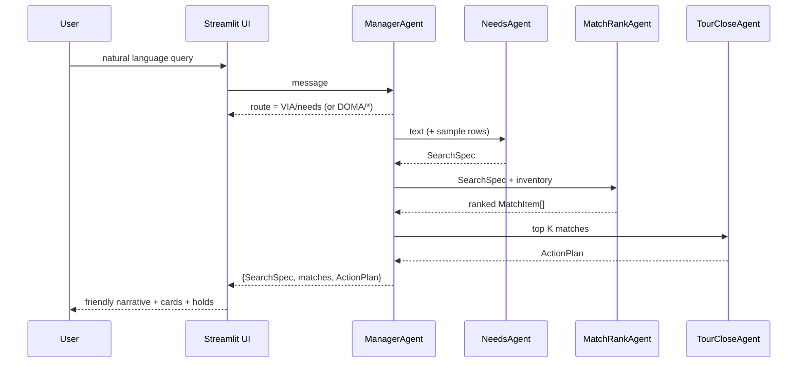
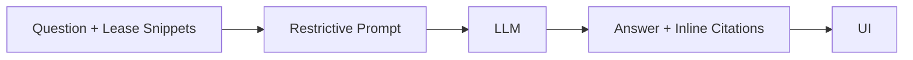
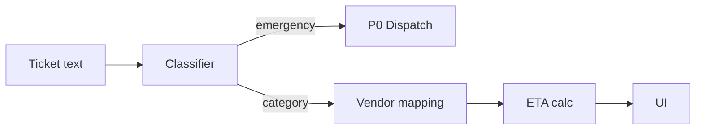
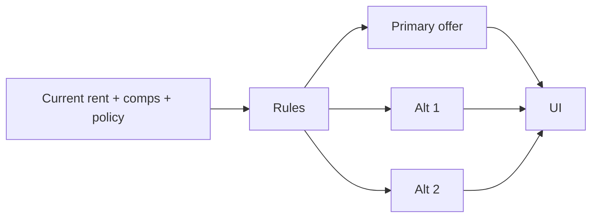

# Appendix: Multi-Agent Architecture, Contracts, and Evaluation

## A. System topology

```mermaid
flowchart TD
  U[User] -->|message| M(ManagerAgent)
  M -->|route VIA| V[VIA Pipeline]
  M -->|route DOMA| D[DOMA Pipeline]

  subgraph VIA (Visit & Acquire)
    VN(NeedsAgent) --> VM(MatchRankAgent) --> VC(TourCloseAgent)
  end

  subgraph DOMA (Documents & Manage)
    DL(LeaseQAAgent)
    DT(ServiceTriageAgent)
    DR(RenewalDealAgent)
  end

  V -.structured-> UI[(Streamlit UI)]
  D -.structured-> UI
  UI -.feedback, holds, uploads.-> M
```

**Routing policy (simplified):**

* `VIA/needs` keywords: `find, search, budget, sqft, location, office, apartment`
* `VIA/tour` keywords: `tour, visit, schedule, book`
* `DOMA/lease` keywords: `lease, clause, deposit, sublet`
* `DOMA/triage` keywords: `leak, repair, hvac, gas, smoke, water`
* `DOMA/renewal` keywords: `renew, extend, offer, increase`

---

## B. Canonical data contracts

> Contracts are intentionally small to keep agents composable.

### B.1 SearchSpec (VIA → matching)

| Field                          | Type                                   | Notes                             |                       |
| ------------------------------ | -------------------------------------- | --------------------------------- | --------------------- |
| `location`                     | `string[]`                             | tokens like “midtown”, “brooklyn” |                       |
| `min_sqft` / `max_sqft`        | `int?`                                 | optional bounds                   |                       |
| `budget_monthly_usd`           | `{min?: number, max?: number} \| null` | normalized to monthly USD         |                       |
| `term_months`                  | `int?`                                 | desired lease term                |                       |
| `must_haves` / `nice_to_haves` | `string[]`                             | amenities or constraints          |                       |
| `timeline`                     | `string?`                              | natural time (“this monday 6pm”)  |                       |
| `use_case`                     | `string?`                              | e.g., “creative studio”           |                       |
| `confidence`                   | `{[k:string]: number}`                 | 0..1 per field                    |                       |
| `spec_status`                  | \`"ok"                                 | "underconstrained"\`              | triggers clarifying Q |

**Example**

```json
{
  "location": ["midtown"],
  "min_sqft": 1500, "max_sqft": 2200,
  "budget_monthly_usd": {"max": 5000},
  "must_haves": ["pet-friendly", "near transit"],
  "timeline": "next 2 weeks",
  "confidence": {"location": 0.82, "budget_monthly_usd.max": 0.76},
  "spec_status": "ok"
}
```

### B.2 MatchItem (matching → UI/closer)

| Field         | Type       | Notes                                                                                                         |
| ------------- | ---------- | ------------------------------------------------------------------------------------------------------------- |
| `id`          | `string`   | unit identifier                                                                                               |
| `score`       | `number`   | 0–100                                                                                                         |
| `reasons`     | `string[]` | short reason codes                                                                                            |
| `row_preview` | `{...}`    | normalized unit row (`address, sqft, rent, ppsf_year, floor, suite, amenities[], near_transit, pet_friendly`) |

### B.3 ActionPlan (closer → UI)

| Field                 | Type                                                                    | Notes         |
| --------------------- | ----------------------------------------------------------------------- | ------------- |
| `actions`             | `Array<{ type:"tour", unit_id, address, start, end, required_docs[] }>` | proposals     |
| `confirmation_prompt` | `string`                                                                | one clear CTA |

### B.4 DOMA outputs

* **LeaseAnswer**: `{ answer: string, citations: [{page?: number, section?: string}], risk_flags?: string[] }`
* **TriageResult**: `{ category: "emergency"|"plumbing"|"hvac"|"general", priority: "P0"|"P1"|"P2", vendor: string, eta_hours: number, confirm_message: string }`
* **RenewalPackage**: `{ primary: Offer, alternatives: Offer[], justification: string, needs_manager_approval: boolean }`
  where `Offer = { rent_usd: number, term_months: number, incentives: string[] }`

---

## C. VIA matching: scoring function

We mix **deterministic features** for reproducibility and ablation.

```text
score = w_size * size_fit
      + w_price * price_fit
      + w_loc * location_match
      + w_must * must_have_overlap
      + w_transit * near_transit_flag
      + w_pets * pet_friendly_match
```

| Component            | Definition                                                  | Suggested weight |   |      |    |    |
| -------------------- | ----------------------------------------------------------- | ---------------- | - | ---- | -- | -- |
| `size_fit`           | +18 if ≥ min; +12 if ≤ max                                  | 18 / 12          |   |      |    |    |
| `price_fit`          | +22 if rent ≤ budget.max                                    | 22               |   |      |    |    |
| `location_match`     | +16 if address/neighborhood contains any `location[]` token | 16               |   |      |    |    |
| `must_have_overlap`  | \`10 \*                                                     | have∩must        | / | must | \` | 10 |
| `near_transit_flag`  | +8 if true                                                  | 8                |   |      |    |    |
| `pet_friendly_match` | +8 if musts include pet\* and unit is pet-friendly          | 8                |   |      |    |    |

> When **no perfect matches**, return top-N with reason codes and suggest a relaxation set (↑budget 10%, expand area, ↘ tighten/relax sqft).

---

## D. Orchestration (message-level sequence)



---

## E. Error handling & fallbacks

| Failure point                   | Symptom            | Fallback                                                                                      |
| ------------------------------- | ------------------ | --------------------------------------------------------------------------------------------- |
| LLM returns non-JSON SearchSpec | Pydantic error     | Lenient coercion → minimal `SearchSpec{spec_status:"underconstrained"}` + clarifying question |
| Messy CSV schema                | Missing columns    | Column map normalization; default values (`amenities=[]`, flags=false)                        |
| No matches                      | Empty result       | Return top-N closest by price/size; propose two specific relaxations                          |
| Lease QA lacks evidence         | Hallucination risk | Restrictive prompt; if not found → “Not found in provided lease” + escalation suggestion      |

---

## F. Data normalization (import layer)

**Units**

* Map headers: `["Unit ID","unique_id","ID"] → unit_id`, `["Square Feet","Size (SF)","SQFT"] → sqft`, `["Rent","Monthly Rent","Price"] → rent`
* Parse numbers: strip `$ , sqft /sf/yr`
* Derive: if `ppsf_year` and `sqft` present but `rent` missing → `rent = ppsf_year * sqft / 12`
* `amenities`: CSV/JSON to list

**Buildings**

* Map headers: `["Building ID","ID"] → building_id`, address, neighborhood
* Flags: `near_transit` from any non-empty transit field; `pet_friendly` from text contains allow/yes/pet/friendly
* Join strategy: `units.building_id` → `buildings.building_id` (fallback: address)

---

## G. Evaluation protocol

### G.1 Offline (reproducible)

* **Datasets**: synthetic + anonymized real CSVs (units, buildings), labeled with ideal top-K for fixed intents
* **Tasks**:

  * *Spec extraction accuracy*: exact/partial match for `min_sqft`, `budget.max`, `location[]`, `must_haves[]`
  * *Ranking quality*: NDCG\@3, Recall\@3 vs. ground truth
  * *Clarification utility*: % underconstrained → single follow-up that resolves missing fields
* **Metrics**:

  * `NDCG@3`, `MRR@3`, `Spec F1` (macro on fields), `% actionable outputs` (ActionPlan produced)

### G.2 Online (human-in-the-loop)

* **Time-to-first-proposal** (s)
* **Click-through on holds** (%)
* **Agreement with agent judgment** (Likert 1–5 on top-3 matches)
* **Deflection** (DOMA): % questions resolved without staff

---

## H. Latency & cost envelope (baseline)

| Stage                          | Target p50       | Notes                                  |
| ------------------------------ | ---------------- | -------------------------------------- |
| NeedsAgent (LLM)               | 350–800ms        | JSON only; small context + sample rows |
| MatchRankAgent (deterministic) | 5–20ms / 1k rows | pure Python scoring                    |
| TourCloseAgent (LLM)           | 250–600ms        | short prompt                           |
| DOMA LeaseQA (LLM)             | 400–900ms        | small chunk window                     |

Guidelines:

* Keep prompts short, avoid streaming large CSVs to the LLM.
* Deterministic ranking to stabilize latency and variance.

---

## I. Extensibility (pluggable points)

| Component           | Replace with             | Why                                |
| ------------------- | ------------------------ | ---------------------------------- |
| NeedsAgent          | any LLM / finetune       | domain adaptation                  |
| MatchRankAgent      | learning-to-rank         | learn from click/hold/final choice |
| LeaseQA retrieval   | FAISS/Weaviate + chunker | larger corpora                     |
| TourCloseAgent      | calendar API             | real bookings                      |
| ManagerAgent router | intent classifier        | lower LLM usage & drift            |

---

## J. Safety & fairness

* **Explainability**: surface reason codes (“Neighborhood match”, “Rent in budget”, “1500 SF fits”).
* **Geographic bias**: restrict geofencing rules to neutral amenities; allow manual overrides.
* **Privacy**: all PII is session-local in OSS build; add redaction hooks before logging.

---

## K. Reference tables (ready to copy into code)

### K.1 Routing keywords (default)

```json
{
  "VIA": {
    "needs": ["need","looking","find","search","budget","sqft","move","location","office","apartment"],
    "tour":  ["tour","visit","schedule","see","book"]
  },
  "DOMA": {
    "lease":   ["lease","clause","deposit","term","sublet","fee"],
    "triage":  ["leak","broken","repair","hvac","ac","heater","issue","maintenance","gas","smoke","water"],
    "renewal": ["renew","extend","offer","increase","proposal","counter"]
  }
}
```

### K.2 Scoring weights (default)

```json
{
  "w_size": 18,
  "w_price": 22,
  "w_loc": 16,
  "w_must": 10,
  "w_transit": 8,
  "w_pets": 8
}
```

---

## L. Minimal JSON examples (copy-paste tests)

```json
// SearchSpec (underconstrained example)
{
  "location": [],
  "min_sqft": null,
  "max_sqft": null,
  "budget_monthly_usd": {"min": null, "max": null},
  "term_months": null,
  "must_haves": [],
  "nice_to_haves": [],
  "timeline": "this monday 6pm",
  "use_case": null,
  "confidence": {},
  "spec_status": "underconstrained"
}
```

```json
// MatchItem
{
  "id": "U-1023",
  "score": 74.5,
  "reasons": ["Neighborhood match", "Rent $4,950 within budget", "1500 SF fits"],
  "row_preview": {
    "address": "36 W 36th St",
    "neighborhood": "Midtown",
    "sqft": 1500,
    "rent": 4950,
    "ppsf_year": 39.6,
    "floor": "E3",
    "suite": "300",
    "amenities": ["elevator","doorman","pet-friendly"],
    "near_transit": true,
    "pet_friendly": true
  }
}
```

```json
// ActionPlan
{
  "actions": [
    {"type":"tour","unit_id":"U-1023","address":"36 W 36th St","start":"2025-08-12T15:30:00Z","end":"2025-08-12T16:00:00Z","required_docs":["photo_id","income_proof"]}
  ],
  "confirmation_prompt": "Book tour 1, or propose another time?"
}
```

---

## M. Diagrams for DOMA paths

### M.1 Lease QA (grounded)



### M.2 Service triage



### M.3 Renewal proposal



---

## N. Repro/ablation checklist

* **Spec extraction**: swap LLMs, measure `Spec F1`
* **Ranking**: set weights to zero per feature → delta in NDCG\@3
* **Relaxation policy**: test budget +10%, area expand, sqft relax → success rate
* **Lease QA**: chunk size vs. accuracy trade-off on citation presence
* **Latency**: p50/p95 timelines per stage (with 1k, 10k rows)

---

drop this at the end of your README or as `APPENDIX.md`. if you want, I can also generate a small synthetic dataset + a reproducible notebook that computes `Spec F1` and `NDCG@3` so your talk/demo includes empirical charts.
